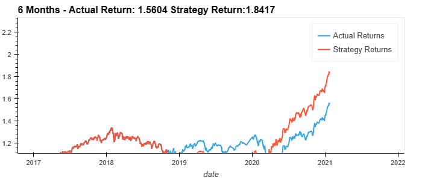
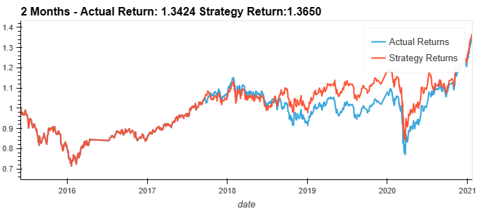
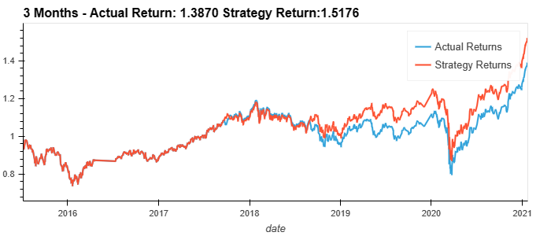
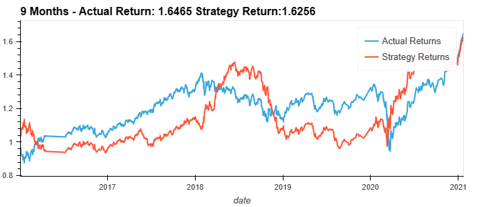
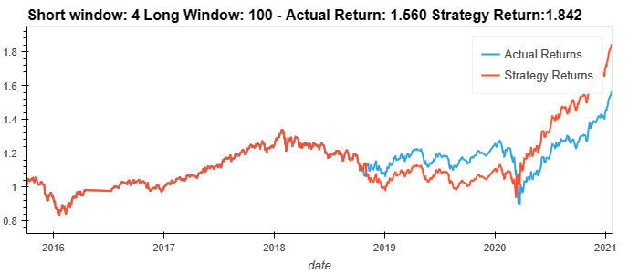
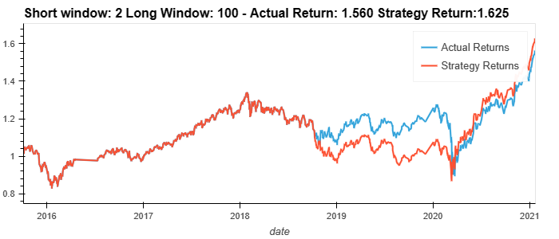
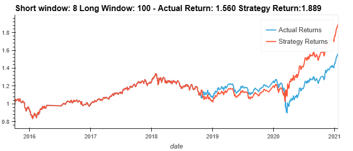
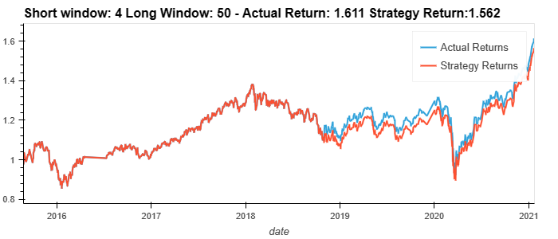
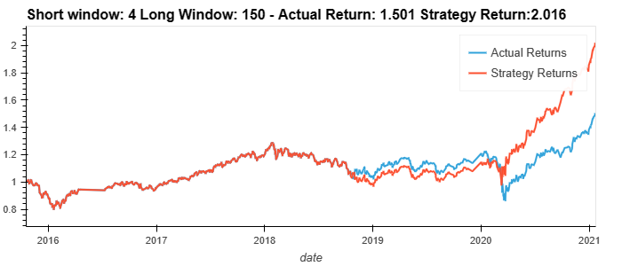
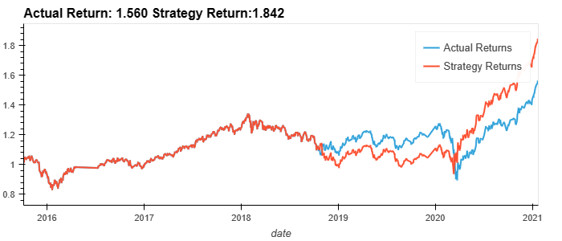

# Machine Learning Trading Bot

Here's my report on the SVM trading bot and optimizing around its parameters:

## Tune the training algorithm by adjusting the size of the training dataset.

The first run of the SVC model had better performance than the actual returns of the security. Strategy returns was 1.8417.

The second run has 2 months of training data and produced a lower Strategy return of 1.365.

The third run has 3 months of training data and produced a lower Strategy return of 1.5176, which was better than 2 months.

The fourth run tried 9 months vs. teh original 6 months. 9 months was the worst case with Strategy underperforming Actuals.

## Tune the trading algorithm by adjusting the SMA input features.

Here's the original baseline of Short = 4 and Long = 100

First, we tried changing the short interval to 2. This reduced the Strategy return.

Next we increased the short interval to 8. This increased the Strategy return slightly.

We returned to short of 4 and modified long to 50. This significantly reduced the Strategy return.

Next, we modified long to 150. This significantly improved the Strategy return to the best result of both short/long and training window trials - 2.016.

## Best Results - Training window of 6 months, Short window of 4 days, Long window of 150 days.

# Evaluate a DecisionTreeClassifier

The original baseline from the SVM model was this: 

Using a DecisionTreeClassified, here was the result:

There doesn't appear to be any significant change. It looks like the SVM model extracted most of the value and the DecisionTreeClassified couldn't improve upon it.
